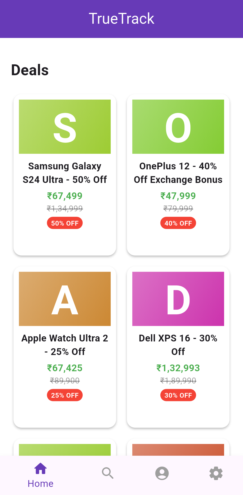
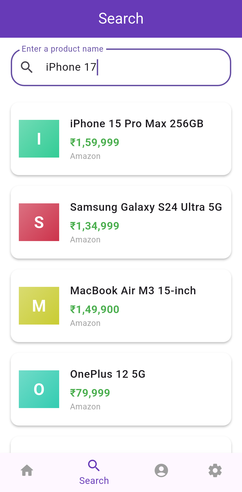
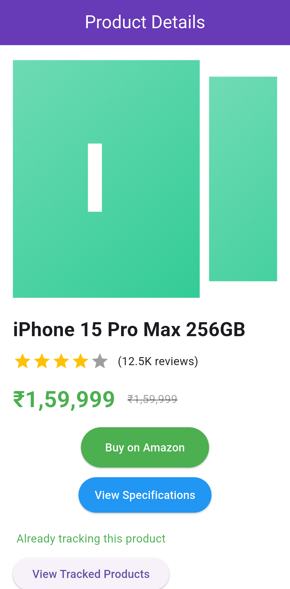
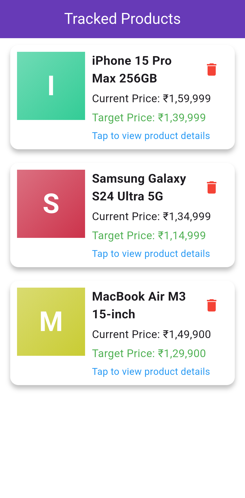
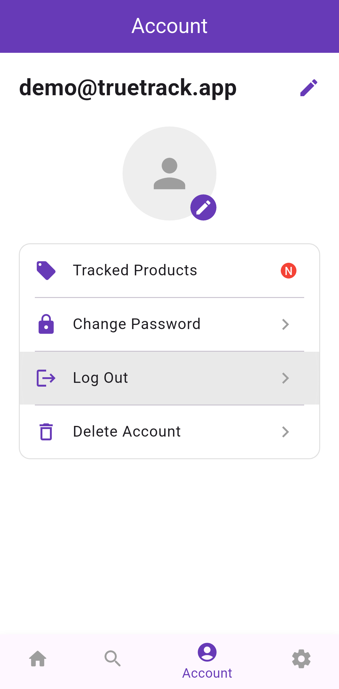

# TrueTrack

**Real-time price tracking for Amazon & Flipkart with AI-powered insights**

Track product prices across Amazon India and Flipkart. Get price history charts, AI-generated review summaries, buy advice, and push notifications when prices drop.

> **Disclaimer:** This app was developed as a BTech capstone project. The public version has been stripped of sensitive data, API keys, and internal configurations. It is shared for portfolio and demonstration purposes only.

---

## Screenshots

| Home | Search | Product |
|:----:|:------:|:-------:|
|  |  |  |

| Tracked Products | Profile |
|:----------------:|:-------:|
|  |  |

---

## Features

- **Cross-platform search** — Search and compare products from Amazon & Flipkart in one place
- **Price history charts** — Interactive price trend charts with touch tooltips
- **AI-powered summaries** — GPT-4o generates concise review summaries, spec breakdowns, and buy advice
- **Price predictions** — Forecast future price trends using historical data
- **Price alerts** — Set target prices and receive push notifications
- **Product tracking** — Save products to monitor price changes over time
- **Search history** — Recent searches persisted per account
- **Deals feed** — Browse current Amazon deals with discount badges
- **Related products** — Discover alternatives when viewing product details
- **Mock mode** — Fully functional offline with pre-seeded demo data; toggle on/off in Settings

---

## Tech Stack

| Layer | Technology |
|-------|-----------|
| Framework | Flutter (Dart) |
| State Management | Provider |
| Auth | Firebase Authentication (email/password) |
| Database | Cloud Firestore |
| Push | Firebase Cloud Messaging + Local Notifications |
| Charts | fl_chart |
| APIs | RapidAPI (Amazon, Flipkart, GPT-4o) |
| Env | flutter_dotenv |

---

## Quick Start

```bash
git clone <repo-url>
cd TrueTrack
flutter pub get
flutter run
```

The app launches in **mock mode** by default — no API keys or Firebase project required. All product data, deals, and price history are pre-seeded for immediate exploration.

To switch between mock and real data, use the toggle in **Settings**.

---

## Mock Mode

TrueTrack includes a built-in mock mode that lets you explore the full feature set without configuring any external services.

| Behaviour | Mock Mode | Real Mode |
|-----------|-----------|-----------|
| Product search | Returns 8 pre-seeded products per source | Queries RapidAPI |
| Deals feed | Returns 6 curated deals | Fetches live Amazon deals |
| Price history | 20-day pre-seeded chart data | Reads from Firestore |
| Price predictions | 7-day forecast + buy advice | AI-generated predictions |
| Auth | Auto-authenticated as `demo@truetrack.app` | Firebase Authentication |
| Notifications | Logs to console | FCM + local notifications |

Toggle mock mode at any time from **Settings → Mock Mode** without restarting the app.

---

## Real API Setup

To use live data instead of mock, you'll need:

### Prerequisites
- [RapidAPI](https://rapidapi.com) key with subscriptions to:
  - [Real-Time Amazon Data API](https://rapidapi.com/letscrape-6bRBa3QguO5/api/real-time-amazon-data)
  - [Real-Time Flipkart API](https://rapidapi.com/KshioLabs/api/real-time-flipkart-api)
  - [Cheapest GPT-4 Turbo API](https://rapidapi.com/successideatech/api/cheapest-gpt-4-turbo-gpt-4-vision-chatgpt-openai-ai-api)
- Firebase project with Authentication, Firestore, and Cloud Messaging enabled

### 1. Environment variables
```bash
cp .env.example .env
```
Edit `.env` and set your RapidAPI key:
```
RAPIDAPI_KEY=your_rapidapi_key_here
```

### 2. Firebase configuration
```bash
dart pub global activate flutterfire_cli
flutterfire configure --project=your-firebase-project-id
```
This regenerates `lib/firebase_options.dart` and platform config files (`google-services.json`, `GoogleService-Info.plist`).

### 3. Run
```bash
flutter run
```
Toggle mock mode **off** in Settings to start using real data.

---

## Project Structure

```
lib/
├── constants/
│   ├── env.dart                # Environment variable accessor
│   └── price_formatter.dart    # Indian price formatting
├── models/
│   ├── product.dart            # Product data model
│   └── app_user.dart           # User model (decoupled from Firebase)
├── pages/
│   ├── home.dart               # Main navigation + deals feed
│   ├── auth_page.dart          # Sign-in / sign-up
│   ├── accounts_page.dart      # Account management
│   ├── product_page.dart       # Product details, charts, tracking
│   ├── product_search.dart     # Search with history
│   ├── product_specifications_page.dart  # Specs + AI summary
│   ├── settings_page.dart      # App settings (mock toggle)
│   └── tracked_products_page.dart       # Tracked products list
├── providers/
│   ├── auth_provider.dart      # Auth state (mock-aware)
│   └── product_provider.dart   # Product search state
├── services/
│   ├── rapidapi_client.dart    # Shared HTTP client
│   ├── amazon_service.dart     # Amazon API calls
│   ├── flipkart_service.dart   # Flipkart API calls
│   ├── ai_service.dart         # GPT-4o API calls
│   ├── notification_service.dart    # FCM + local notifications
│   ├── firestore_service.dart  # Firestore CRUD (decoupled types)
│   ├── service_registry.dart   # Central mock/real service switch
│   └── mock/
│       ├── mock_data.dart          # Pre-seeded demo data
│       ├── mock_amazon_service.dart
│       ├── mock_flipkart_service.dart
│       ├── mock_ai_service.dart
│       ├── mock_firestore_service.dart
│       └── mock_notification_service.dart
├── widgets/
│   └── product_image.dart      # Network image with offline fallback
└── main.dart                   # Entry point + Provider wiring
```

## Team

| | |
|---|---|
|  |  |
| [**Sohan Gogula**](https://github.com/Gogula11) · [LinkedIn](https://www.linkedin.com/in/sohangogula) | [**Aadi Khot**](https://github.com/aadikhot0102) · [LinkedIn](https://www.linkedin.com/in/aadi-khot-785810302/) |
|  |  |
| [**Ashrith Telukuntla**](https://github.com/ashrith0302) · [LinkedIn](https://www.linkedin.com/in/ashrith-telukuntla-56726b2b7/) | [**B MANICHARAN**](https://github.com/BMANICHARANREDDY) · [LinkedIn](https://www.linkedin.com/in/b-manicharan-reddy-a8175028b/) |

---

## Security

- API keys and Firebase config are **never committed** to the repository
- RapidAPI key stored in `.env` (gitignored)
- Firebase config generated per-device via `flutterfire configure`
- `.env`, `google-services.json`, `GoogleService-Info.plist`, `firebase_options.dart` are gitignored
- Android signing keys (`*.jks`, `*.keystore`) excluded from version control